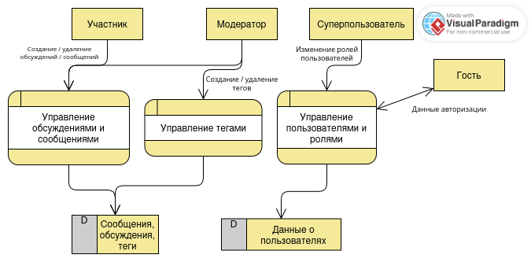

# Модель угроз

## Модель продукта

Компоненты продукта описаны в пункте 6 паспорта проекта.

Основное взаимодействие:

`Пользователь -> веб-клиент -> сервер приложения -> база данных`

Здесь под пользователем понимаются гость, участник, модератор и суперпользователь. Для удобства и подробности модель продукта представлена визуально: 

**Что уже существует:**

**Что пока планируется:**

**Существенные допущения:**

## Границы доверия

| Граница              | Что пересекает                                                                                                       | Почему требуется проверка                          |
| -------------------- | -------------------------------------------------------------------------------------------------------------------- | -------------------------------------------------- |
| веб-клиент -> сервер | Данные авторизации; запросы создания / удаления сообщений / обсуждений / тегов; данные изменения ролей пользователей | Нужна проверка прав пользователя и его подлинности |

## Значимые объекты и свойства

Значимые объекты и свойства подробно описаны в пункте 5 паспорта

## Угрозы

| ID  | Сценарий угрозы                                                                                          | Что нарушается                                                                | Граница / точка входа                             | Связанные SR                                     | Приоритет и обоснование                                                                           |
| --- | -------------------------------------------------------------------------------------------------------- | ----------------------------------------------------------------------------- | ------------------------------------------------- | ------------------------------------------------ | ------------------------------------------------------------------------------------------------- |
| T-1 | Участник в обход ограничений веб-клиента отправляет запрос на удаление чужого сообщения / обсуждения     | Целостность сообщений, обсуждений                                             | Участник -> веб-сервер                            | SR-2                                             | Высокий. Угроза полностью ломает логику работы форума, искажает дискуссию.                        |
| T-2 | Злоумышленник получает данные авторизации модератора и от его лица удаляет сообщения / обсуждения / теги | Целостность сообщений, обсуждений, тегов; авторизация пользователя приложения | гость -> управление пользователями и ролями       | SR-5, SR-6 (добавлены после формулировки угрозы) | Высокий. Позволяет без существенных проблем получить доступ к созданию и удалению от чужого лица. |
| T-3 | Участник по ошибке удаляет собственное обсуждение                                                        | Целостность сообщений, обсуждений                                             | Участник -> управление сообщениями и обсуждениями | SR-7 (добавлено после формулировки угрозы)       | Средний. Для осуществления угрозы нужна последовательность ошибочных действий.                    |
| T-4 | Гость в обход ограничений веб-клиента отправляет запрос на создание сообщения / обсуждения без авторизации | Разграничение доступа; целостность сообщений, обсуждений | Гость -> веб-сервер | SR-1 | Высокий. Позволяет любому гостю публиковать нежелательный контент в обход правил форума. |
| T-5 | Участник подменяет идентификатор автора в запросе создания сообщения и публикует его от чужого имени | Подлинность авторства; целостность сообщений | Участник -> веб-сервер | SR-4 | Высокий. Не требует доступа к чужому аккаунту, искажает дискуссию и вводит пользователей в заблуждение. |
| T-6 | Модератор подставляет в запрос удаления идентификатор сообщения, обсуждения или тега другого модератора и удаляет его | Целостность сообщений, обсуждений и тегов; разграничение полномочий модераторов | Веб-клиент -> сервер приложения; запрос удаления объекта | SR-3 | Высокий. Модератор уже имеет доступ к операции удаления; недостаточная проверка объекта позволяет удалить контент другого модератора. |
| T-7 | Участник напрямую отправляет запрос создания или удаления тега. | Целостность тегов и связей обсуждений с тегами; разграничение полномочий участника и модератора | Веб-клиент -> сервер приложения; запрос создания или удаления тега | SR-8 | Высокий. Достаточно обычной учётной записи и прямого запроса к серверу; несанкционированное изменение тегов нарушает организацию обсуждений и поиск по тегам. |

## Приоритетный набор

ID выбранных угроз и общее объяснение выбора. Если выбор уже однозначно отмечен и объяснён в таблице, удалите этот раздел.
